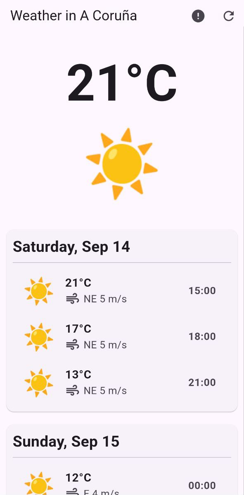

# Weather Forecast App using 7Timer API

A weather forecasting app built with Flutter, utilizing the 7Timer API to display the weather data for a specific location. This application was developed as an illustrative example of handling asynchronous tasks in Flutter. It provides a user-friendly interface with forecasts grouped by day and time, showing key weather information like temperature, wind speed, and precipitation type. The app features asynchronous data fetching, error handling, and interactive UI elements.



## Features

- Fetches weather forecast data from the [7Timer API](http://www.7timer.info/doc.php?lang=en).
- Displays weather forecasts grouped by day with time-specific information.
- Shows detailed information such as temperature, wind speed, and precipitation type.
- Interactive UI with clickable list items that display more details using Snackbars.
- Handles errors during data fetching and displays loading indicators when necessary.

## Technologies Used

- **Flutter**: Frontend UI development and state management.
- **Dart**: Programming language for building the Flutter app.
- **7Timer API**: Provides the weather forecast data.
- **HTTP**: For making asynchronous API calls.
- **Intl**: For date and time formatting.

## Getting Started

### Prerequisites

- [Flutter SDK](https://flutter.dev/docs/get-started/install) must be installed on your system.
- A text editor or IDE (such as VS Code or Android Studio) with Flutter support.
- A valid internet connection for fetching weather data.

### Installation

1. Clone the repository:
    ```bash
    git clone https://github.com/betazetadev/async_weather_demo.git
    ```

2. Navigate into the project directory:
    ```bash
    cd async_weather_demo
    ```

3. Install dependencies:
    ```bash
    flutter pub get
    ```

4. Run the app:
    ```bash
    flutter run
    ```

### Usage

- The app will automatically fetch the weather forecast for a specific location (e.g., A Coruña, Spain by default).
- The forecasts are grouped by day, with each timepoint showing temperature, wind speed, and weather icons.
- Click on any forecast item to view additional details in a Snackbar.
- The error button at the top-right corner can be used to simulate an error during data fetching.
- The refresh button at the top-right corner can be used to reload the weather forecast data.

## API

This app uses the **7Timer API** to fetch weather forecast data.

- API Documentation: [7Timer API](http://www.7timer.info/doc.php?lang=en)
- Example API call:
    ```
    https://www.7timer.info/bin/astro.php?lon=-8.453883&lat=43.3619292&ac=0&unit=metric&output=json&tzshift=0
    ```

## License

Distributed under the GNU GPL v3 License. See `LICENSE` for more information.

## Contact

For any questions or feedback, feel free to reach out:

- GitHub: [betazetadev](https://github.com/betazetadev)
- Email: hi@betazeta.dev
- Website: [betazeta.dev](https://betazeta.dev)